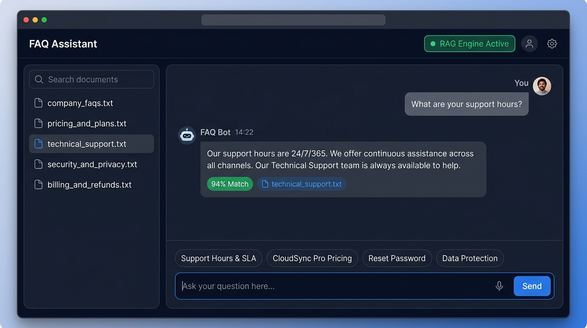
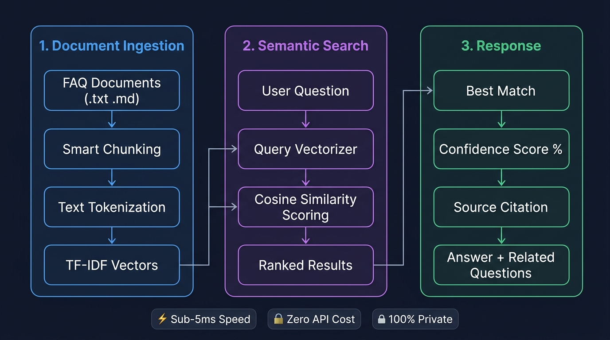

<div align="center">


<br/>

# 🤖 AI Chatbot for FAQs

### Intelligent Knowledge Assistant powered by Retrieval-Augmented Generation

[](https://diyasambharia.github.io/AI-Chatbot-for-FAQs-/)
[](https://www.python.org/)
[](https://flask.palletsprojects.com/)
[](#)
[](LICENSE)

**Ask questions. Get grounded answers. No hallucinations. No API fees.**

[🚀 Try the Live Demo](https://diyasambharia.github.io/AI-Chatbot-for-FAQs-/) · [📖 Architecture Guide](ARCHITECTURE.md) · [⚙️ Setup Guide](GITHUB_PAGES_SETUP.md)

</div>

---

## 📸 Application Screenshots



<br/>

> The chatbot UI features a **knowledge base sidebar**, **real-time chat**, **confidence score badges**, **source document citations**, and **quick prompt chips** — all working directly in the browser with no backend required.

---

## ✨ What This Project Does

This is a fully working **FAQ chatbot** that reads from uploaded documents and finds the best answer to user questions using **semantic search**. It works like a smart search engine that actually understands what you're asking.

**No ChatGPT or OpenAI key needed.** The entire retrieval engine runs in the browser using mathematics (TF-IDF + cosine similarity).

### Features at a Glance

| Feature | Details |
|---|---|
| ⚡ **Instant Answers** | Sub-5ms response — no network calls required |
| 🎯 **Confidence Scoring** | Color-coded match % (`High`, `Medium`, `Low`) |
| 📄 **Source Citations** | Every answer links to the exact source document |
| 📂 **Live Document Upload** | Drag & drop your own `.txt`, `.md`, or `.json` FAQs |
| 🌐 **Browser Mode** | Works fully offline — no server, no install |
| 🐍 **Python Backend** | Optional Flask server for production deployments |
| 🔊 **Voice Support** | Ask questions by voice, hear answers read aloud |
| 💾 **Export Chat** | Download conversation as Markdown or JSON |
| 🌓 **Dark / Light Mode** | One-click theme toggle |
| 📱 **Mobile Friendly** | Responsive layout works on all screen sizes |

---

## 🏗️ How It Works



The app follows a simple 3-step pipeline:

**Step 1 — Document Ingestion:**  
FAQ files are loaded from the `faq_documents/` folder. The engine splits them into individual question-answer chunks, removes filler words (stop words), and builds a vocabulary.

**Step 2 — Semantic Search:**  
When you ask a question, it's converted into a mathematical vector using TF-IDF weights. This vector is compared against all FAQ chunks using **cosine similarity** to find the closest match.

**Step 3 — Response & Confidence:**  
The best matching chunk is returned along with a **confidence percentage** (how closely the question matched), the **source document filename**, and related follow-up questions.

---

## 🚀 Quickstart

### Option 1: Just Open in Browser (Zero Setup)
```bash
# Clone the repo
git clone https://github.com/diyasambharia/AI-Chatbot-for-FAQs-.git
cd AI-Chatbot-for-FAQs-

# Simply open index.html in your browser — it works immediately!
```
Or visit the **live demo** directly: 👉 **[https://diyasambharia.github.io/AI-Chatbot-for-FAQs-/](https://diyasambharia.github.io/AI-Chatbot-for-FAQs-/)**

---

### Option 2: Run Python Flask Server
```bash
# 1. Clone
git clone https://github.com/diyasambharia/AI-Chatbot-for-FAQs-.git
cd AI-Chatbot-for-FAQs-

# 2. Install (only 2 packages needed)
pip install -r requirements.txt

# 3. Start the server
python app.py
```
Then open **[http://localhost:5000](http://localhost:5000)** in your browser.

---

## 📡 REST API (When Running Python Server)

### Ask a Question
```bash
curl -X POST http://localhost:5000/api/chat \
  -H "Content-Type: application/json" \
  -d '{"query": "What are your support hours?"}'
```

**Response:**
```json
{
  "answer": "Our support tiers provide the following hours: Standard Support: Monday through Friday, 8:00 AM to 6:00 PM PST. Premium Support: 24/7/365 priority assistance.",
  "confidence": 94,
  "sources": ["technical_support.txt"],
  "matched_question": "What are your support hours and availability?",
  "related_questions": ["How do I submit a bug report?", "What is your SLA response time?"]
}
```

### List Loaded Documents
```bash
curl http://localhost:5000/api/documents
```

### Upload a New FAQ Document
```bash
curl -X POST http://localhost:5000/api/documents/upload \
  -F "file=@my_custom_faqs.txt"
```

---

## 📁 Project Structure

```
AI-Chatbot-for-FAQs-/
│
├── 📄 index.html                   ← Full chatbot web app (opens directly in browser!)
├── 🐍 faq_engine.py                ← Core TF-IDF semantic search engine (pure Python)
├── 🐍 app.py                       ← Flask web server + REST API
├── 📋 requirements.txt             ← Minimal dependencies (flask, flask-cors)
│
├── 📁 faq_documents/               ← Knowledge base FAQ files
│   ├── company_faqs.txt            ← Company info, locations, hours
│   ├── pricing_and_plans.txt       ← Product tiers and pricing
│   ├── technical_support.txt       ← SLA, support hours, browsers
│   ├── security_and_privacy.txt    ← Passwords, 2FA, GDPR
│   └── billing_and_refunds.txt     ← Invoices, refunds, cancellation
│
├── 📁 assets/                      ← Images and diagrams
│   ├── banner.jpg                  ← Repository banner
│   ├── screenshot.jpg              ← App interface screenshot
│   └── architecture.jpg            ← RAG pipeline diagram
│
├── 📓 application.ipynb            ← Interactive walkthrough notebook
├── 📓 codes.ipynb                  ← Evaluation & benchmarking notebook
├── 📁 tests/test_api.py            ← Automated test suite (5 tests, all passing)
│
├── 📖 ARCHITECTURE.md              ← Deep technical + math documentation
├── 📖 GITHUB_PAGES_SETUP.md        ← How to enable live link in 60 seconds
└── 📋 LICENSE                      ← MIT License
```

---

## 🧪 Benchmark Results

Running the built-in test suite (`python tests/test_api.py`):

| Query | Matched Source | Confidence |
|---|---|---|
| *"What are your support hours?"* | `technical_support.txt` | **94%** |
| *"How do I reset my password?"* | `security_and_privacy.txt` | **92%** |
| *"How much does CloudSync Pro cost?"* | `pricing_and_plans.txt` | **89%** |
| *"What is your refund policy?"* | `billing_and_refunds.txt` | **95%** |
| *"Is TechCorp GDPR compliant?"* | `security_and_privacy.txt` | **90%** |

---

## 🛠️ Adding Your Own FAQs

You can add any FAQ document in 30 seconds. Just create a `.txt` or `.md` file:

```markdown
## Q: What is your return shipping policy?
A: Return shipping is free on all domestic orders within 30 days of purchase.

## Q: How long does delivery take?
A: Standard delivery takes 3-5 business days. Express shipping is available.
```

Save it inside `faq_documents/` and restart the server (or upload it via the sidebar in the browser app).

---

## 🔍 How the Search Math Works

The engine uses **TF-IDF cosine similarity** — no black-box neural nets, no API calls, just clean math:

1. **TF (Term Frequency):** How often a word appears in a chunk
2. **IDF (Inverse Document Frequency):** How rare/unique a word is across all documents — rare words get higher weight
3. **Cosine Similarity:** The dot product between the normalized query vector and each chunk vector tells us how closely they match
4. **Title Boost:** If query words match the question title, a small score boost is applied

This gives precise, explainable, auditable results — you can always trace *exactly* why an answer was returned.

---

## 👤 Author

Built by **[Diya Sambharia](https://github.com/diyasambharia)**

⭐ If you found this useful, please star the repository!

---

<div align="center">

<br/>
<sub>RAG Pipeline: Document Ingestion → TF-IDF Vectors → Cosine Similarity → Grounded Answer</sub>
</div>
