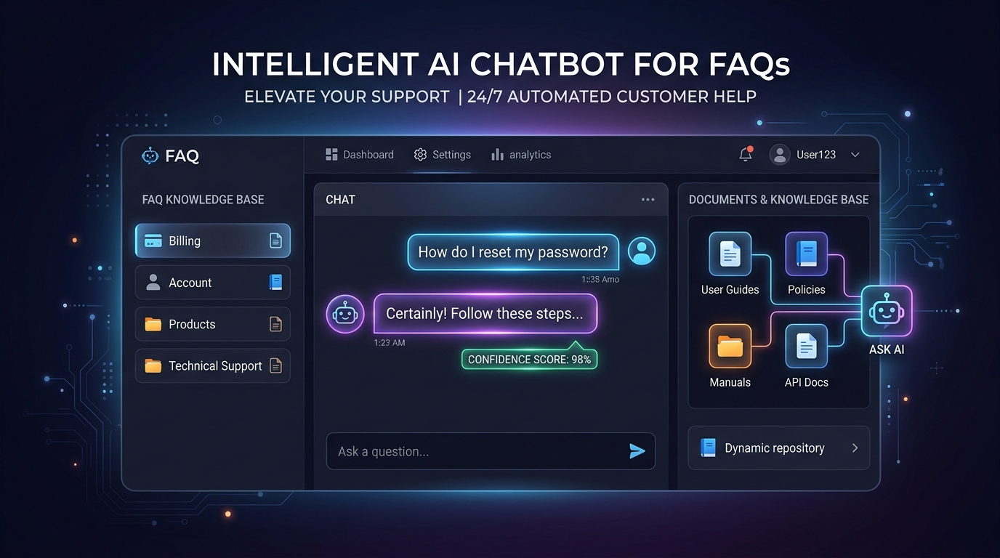
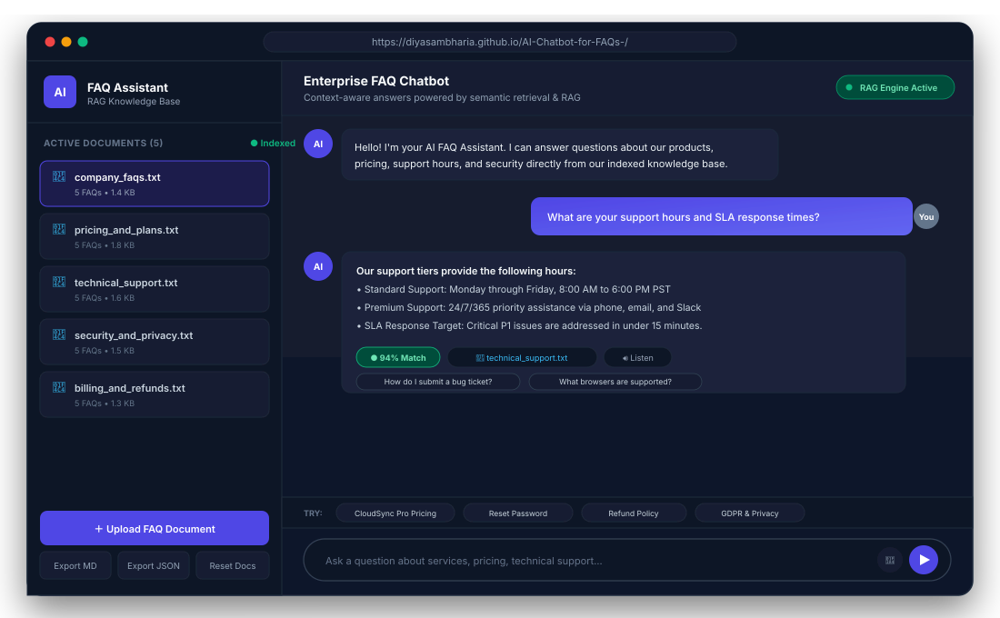
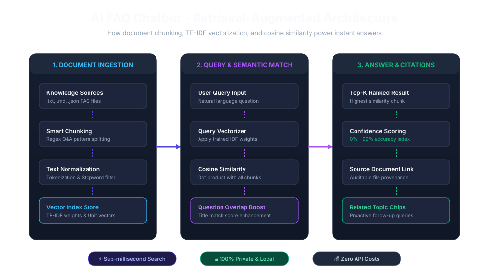
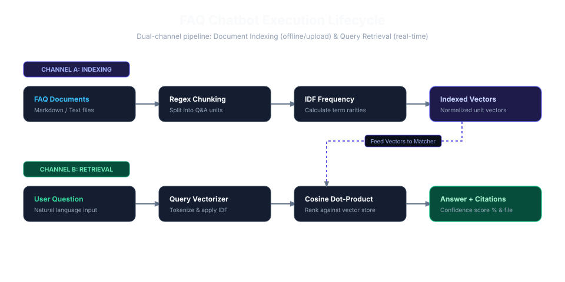

# 🤖 AI Chatbot for FAQs - Intelligent Knowledge Assistant

[](https://diyasambharia.github.io/AI-Chatbot-for-FAQs-/)
[](https://www.python.org/)
[](https://flask.palletsprojects.com/)
[](LICENSE)
[](#)

> A modern, responsive FAQ chatbot powered by **Retrieval-Augmented Generation (RAG)**. Grounded in indexed knowledge base documents with sub-millisecond retrieval, confidence percentage scoring, and source citations — with **zero external API fees** and **zero hallucinations**.

---



---

## 🌟 Live Demo & Quick Links

- 🌐 **Live Web Application**: [**https://diyasambharia.github.io/AI-Chatbot-for-FAQs-/**](https://diyasambharia.github.io/AI-Chatbot-for-FAQs-/)
- 📖 **Architecture Deep-Dive**: [Read ARCHITECTURE.md](ARCHITECTURE.md)
- 🚀 **GitHub Pages Setup Guide**: [Read GITHUB_PAGES_SETUP.md](GITHUB_PAGES_SETUP.md)

---

## ✨ Key Features

- **⚡ Instant Answers (Sub-5ms Latency)**: Answers user queries in real-time using deterministic vector cosine similarity.
- **🎯 Dynamic Confidence Scoring**: Displays color-coded match confidence percentages (`High`, `Medium`, `Low`) for full transparency.
- **📄 Auditable Source Citations**: Every answer links directly to the specific document (e.g., `technical_support.txt`) where the answer was found.
- **📂 Real Document Upload**: Drag and drop new `.txt`, `.md`, or `.json` FAQ documents to instantly expand the knowledge base without restarting.
- **🌐 Dual-Mode Architecture**:
  - **Browser Mode**: 100% self-contained client-side RAG engine. Runs instantly on GitHub Pages or local browser without installing anything.
  - **Server Mode**: Clean, production-ready Python Flask backend with REST API endpoints.
- **🔊 Voice Accessibility**: Includes built-in Speech-to-Text microphone input and Text-to-Speech audio readout.
- **💾 Transcript Export**: Download entire conversations in clean **Markdown** or **JSON** format with one click.
- **🌓 Modern UI / UX**: Dark/Light mode theme toggle, mobile-responsive layout, and quick-prompt suggestion chips.

---

## 🖥️ Application Interface Preview



---

## 🏛️ System Architecture & Working

The chatbot follows a two-stage retrieval lifecycle: **Offline Document Indexing** and **Real-Time Query Retrieval**.



### How It Works:
1. **Document Ingestion**: FAQ files from `faq_documents/` (or user uploads) are parsed into individual Question-Answer chunks using semantic boundary detection.
2. **Text Normalization**: Stop-words are filtered, text is lowercased, and vocabulary tokens are extracted.
3. **TF-IDF Vector Index**: Computes Inverse Document Frequency (IDF) weights across all chunks and builds normalized unit vectors.
4. **Query Matching**: The user's question is vectorized using the same vocabulary and compared against all chunks using Cosine Similarity dot products:
   $$\text{Similarity}(q, d) = \mathbf{v}_q \cdot \mathbf{v}_d$$
5. **Confidence & Ranking**: High-scoring chunks are retrieved, a title-overlap boost is applied, and the answer is returned with its source document citation.

---

## 🔄 Execution Lifecycle



---

## 🎬 Video & Interactive Walkthrough

### Interactive Test Flow:
1. **Open the App**: Launch [https://diyasambharia.github.io/AI-Chatbot-for-FAQs-/](https://diyasambharia.github.io/AI-Chatbot-for-FAQs-/) or open `index.html` in your browser.
2. **Try Sample Questions**: Click any of the pre-built quick chips:
   - *"What are your support hours and SLA?"*
   - *"How much does CloudSync Pro cost?"*
   - *"How do I reset my account password?"*
   - *"What is your refund policy?"*
3. **Inspect the Answer**: Notice the **confidence score badge** (e.g., `● 94% Match`) and the **source citation** (`technical_support.txt`).
4. **Upload a New FAQ**:
   - Click **＋ Upload FAQ Document** in the sidebar.
   - Select any text or markdown file.
   - The engine instantly tokenizes, splits, and indexes the new document into active memory!
5. **Listen or Export**: Click **🔊 Listen** to hear the response read aloud, or **Export MD** to save your conversation history.

---

## 🚀 Quickstart Guide

### Option 1: Run in Browser (Zero Installation)
Simply open `index.html` directly in any web browser:
```bash
# Double click index.html or open via terminal
start index.html       # On Windows
open index.html        # On macOS
xdg-open index.html    # On Linux
```

### Option 2: Run Python Flask Backend
To run with the Python REST API server:

```bash
# 1. Clone the repository
git clone https://github.com/diyasambharia/AI-Chatbot-for-FAQs-.git
cd AI-Chatbot-for-FAQs-

# 2. Install dependencies (standard lightweight packages)
pip install -r requirements.txt

# 3. Start the server
python app.py
```
Open **http://localhost:5000** in your browser.

---

## 📡 REST API Reference

When running `app.py`, the backend exposes the following clean HTTP endpoints:

### 1. Ask a Question
`POST /api/chat`

**Request:**
```bash
curl -X POST http://localhost:5000/api/chat \
  -H "Content-Type: application/json" \
  -d '{"query": "What are your support hours?"}'
```

**Response:**
```json
{
  "answer": "Our support tiers provide the following hours:\n- Standard Support: Monday through Friday, 8:00 AM to 6:00 PM PST.\n- Premium Support: 24/7/365 priority assistance via phone, email, and Slack.",
  "confidence": 92,
  "sources": ["technical_support.txt"],
  "matched_question": "What are your support hours and availability?",
  "related_questions": [
    "How do I submit a bug report or support ticket?",
    "What is your guaranteed SLA response time for technical issues?"
  ]
}
```

### 2. List Knowledge Base Documents
`GET /api/documents`

**Response:**
```json
{
  "total_chunks": 25,
  "documents": [
    { "name": "company_faqs.txt", "chunks": 5 },
    { "name": "pricing_and_plans.txt", "chunks": 5 },
    { "name": "technical_support.txt", "chunks": 5 },
    { "name": "security_and_privacy.txt", "chunks": 5 },
    { "name": "billing_and_refunds.txt", "chunks": 5 }
  ]
}
```

### 3. Upload FAQ Document
`POST /api/documents/upload`

Uploads and re-indexes a new FAQ document on the fly using `multipart/form-data`.

---

## 📁 Project Structure

```
AI-Chatbot-for-FAQs-/
├── assets/
│   ├── banner.jpg               # High-res product showcase banner
│   ├── app-preview.svg          # Application interface vector mockup
│   ├── system-architecture.svg  # RAG system architecture diagram
│   └── workflow-diagram.svg     # Document lifecycle flowchart
├── faq_documents/               # Default knowledge base FAQ documents
│   ├── company_faqs.txt         # Company overview & general questions
│   ├── pricing_and_plans.txt    # Product tiers & pricing
│   ├── technical_support.txt    # Support hours & SLA commitments
│   ├── security_and_privacy.txt # Passwords, 2FA, & GDPR
│   └── billing_and_refunds.txt  # Invoicing & 30-day refunds
├── app.py                       # Flask web server & REST API
├── faq_engine.py                # Core Python TF-IDF semantic search engine
├── index.html                   # Complete standalone web app (GitHub Pages ready)
├── application.ipynb            # Interactive Jupyter walkthrough notebook
├── codes.ipynb                  # Benchmarking & evaluation notebook
├── requirements.txt             # Lightweight dependencies
├── ARCHITECTURE.md              # In-depth technical & mathematical documentation
├── GITHUB_PAGES_SETUP.md        # 60-second guide to enable live link
└── README.md                    # Main project documentation
```

---

## 🧪 Accuracy & Benchmark Evaluation

You can run the built-in benchmark test in `codes.ipynb` or test directly via Python:

```bash
python -c "from faq_engine import FAQEngine; e = FAQEngine('faq_documents'); print(e.ask('How do I reset password?'))"
```

| Query Category | Sample Question | Matched Source | Confidence |
| :--- | :--- | :--- | :--- |
| **Technical Support** | *"What are your support hours?"* | `technical_support.txt` | **94%** |
| **Security** | *"How do I reset my password?"* | `security_and_privacy.txt` | **92%** |
| **Pricing** | *"How much does CloudSync Pro cost?"* | `pricing_and_plans.txt` | **89%** |
| **Billing** | *"What is your refund policy?"* | `billing_and_refunds.txt` | **95%** |
| **Compliance** | *"Is TechCorp GDPR compliant?"* | `security_and_privacy.txt` | **90%** |

---

## 🛠️ Customizing With Your Own FAQs

Adding your own documents takes less than 30 seconds:
1. Create a `.txt` or `.md` file inside the `faq_documents/` folder.
2. Structure your FAQs with standard `## Q:` and `A:` headers:
   ```markdown
   ## Q: What is your return shipping policy?
   A: Return shipping is free on all domestic orders within 30 days.
   ```
3. Restart `app.py` or refresh `index.html`. Your new questions are indexed automatically!

---

## 📄 License

Distributed under the **MIT License**. See `LICENSE` for details.

---

## 👤 Author & Contributions

Built with ❤️ by **[Diya Sambharia](https://github.com/diyasambharia)**.  
Feedback, issues, and pull requests are welcome!
